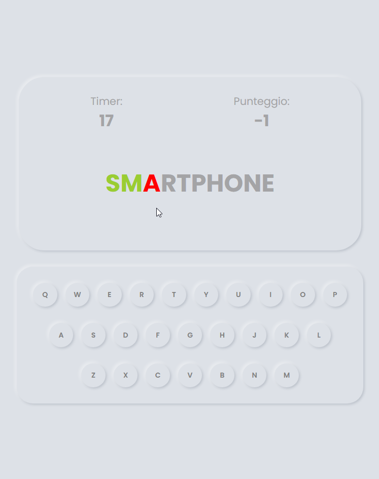

# Words-game

## Description

Words-game is a web-based game that tests your typing skills by challenging you to correctly type a given word within a certain time limit. The app provides a keyboard interface where you can press the corresponding keys to type the word displayed on the screen.

This challenge is part of the Frontenders Italian Community.

## Features

- Word Display: The app randomly selects a word from an array of words and displays it on the screen.
- Keyboard Input: You can either click the virtual keys on the screen or use your physical keyboard to input the letters of the displayed word.
- Timing and Scoring: The app starts a timer as soon as you begin typing. It keeps track of the time taken to complete the word and calculates your score based on the accuracy and speed of your typing.
- Visual Feedback: The app provides visual cues to indicate whether you've typed the correct letter or made a mistake. Correctly typed letters are highlighted in green, while incorrect ones are highlighted in red.
- Game Completion: Once you've successfully typed the entire word, the game finishes, and a congratulatory message is displayed. Additionally, confetti animations are triggered to celebrate your achievement.
- Play Again: After completing a game, you have the option to play again by clicking the "Play Again" button.

## Technology

  
 
  
  

## Demo

To see a live demo of the Words-game, visit [Demo](https://www.massidev.com/portfolio/words-game/).

## Installation

To run the Words-game locally, follow these steps:

1. Clone the repository: `git clone https://github.com/massi-17/words-game.git`
2. Navigate to the project directory: `cd words-game`
3. Open the `index.html` file in your preferred web browser.

## Contributing

Contributions are welcome! If you want to contribute to this Words-game, please follow these steps:

1. Fork the repository.
2. Create a new branch: `git checkout -b feature/your-feature`.
3. Make your changes and commit them: `git commit -m 'Add your feature'`.
4. Push to the branch: `git push origin feature/your-feature`.
5. Submit a pull request.

